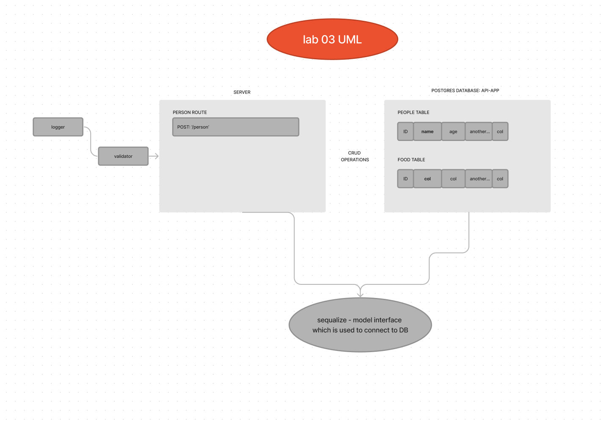

# LAB - 03 basic-express-server

### Deployment Test

#### Author: Elaine Huynh
 - tests report

 #### Setup
    **.env** requirements
    - PORT - 3001

    Running the app
    - npm start
    - Endpoint: /person (with or without name query)
        - returns array with data from postgres collection

#### Tests
    - Unit Tests: npm run test
    - Lint Tests: npm run lint

#### UML

## Links
- Latest PR on GitHub: https://github.com/nurselaine/basic-express-server/actions
- Heroku link: https://nurselaine-express-server-prod.herokuapp.com/
